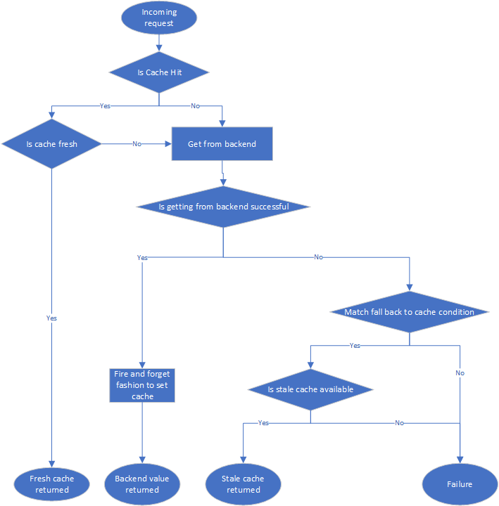
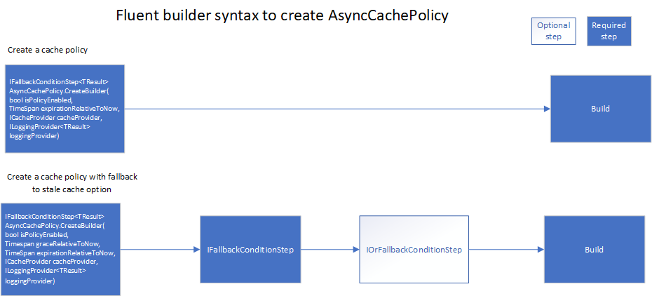
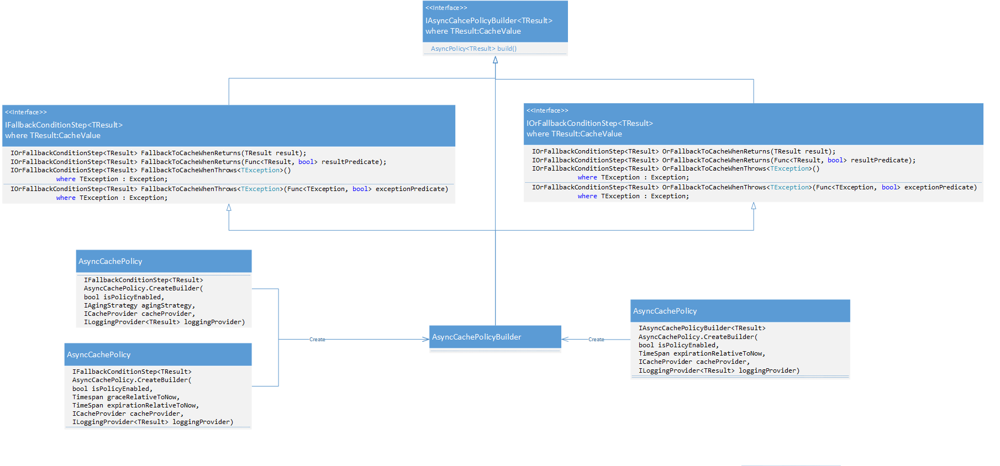

<!-- MarkdownTOC -->

- [Async cache policy](#async-cache-policy)
	- [Purpose](#purpose)
	- [Use cases](#use-cases)
	- [Roadmap](#roadmap)
	- [Operation](#operation)
	- [Syntax](#syntax)
		- [Onboard cache target](#onboard-cache-target)
		- [Build policy](#build-policy)
			- [Builder overview](#builder-overview)
			- [Use builder](#use-builder)
		- [Configure policy](#configure-policy)
			- [Configure cache policy with FixedAgingStrategy](#configure-cache-policy-with-fixedagingstrategy)
			- [Configure multiple cache policies](#configure-multiple-cache-policies)
		- [Use policy](#use-policy)
	- [Parameters](#parameters)
		- [CacheValue](#cachevalue)
		- [ICacheProvider](#icacheprovider)
		- [ILoggingProvider](#iloggingprovider)
		- [IAgingStrategy](#iagingstrategy)
	- [Usage recommendations](#usage-recommendations)
		- [Cache response selectively](#cache-response-selectively)
		- [Cache null value](#cache-null-value)
		- [Cache migration](#cache-migration)
		- [Test with chaos tools](#test-with-chaos-tools)
		- [Sample Integration PRs](#sample-integration-prs)

<!-- /MarkdownTOC -->

# Async cache policy

## Purpose
The Microsoft.Teams.ServicesHub.Polly.AsyncCachePolicy is an implementation of read-through cache, also known as the cache-aside pattern. It provides a resiliency feature of elegantly fallback to return stale cache value when downstream services return errors or throw exceptions. 

## Use cases
AsyncCachePolicy could be used anywhere an IAsyncPolicy<TResult> Polly policy applies and seamlessly wrapped together with other Polly policies. It could be used in the following two cases: 
1. Used as a Polly cache policy. 
2. Used as a Polly cache policy with the capability to fallback to stale cache. 

## Roadmap
1. By default [Newtonsoft.Json serializer](https://www.newtonsoft.com/json) is used to serialize cache targets. In the future, consumers of this package will be able to plugin customized serializers. 
2. Support caching value types. Currently all onboarding targets need to extend from the base CacheValue abstract class, thus must be reference types. 
3. Provide an implementation of ILoggingProvider based on ApplicationInsights. 

## Operation
* This is a non-reactive policy with some reactive features (fallback option to return stale cache value). There are in total six conditions which could happen:
1. When cache is fresh, it will directly return fresh cache value. 
2. When cache is stale and the operation to get backend value succeeds, fetched backend value will be returned and then a background job will be kicked off for refreshing cache.
3. When cache is stale and the operation to get backend value fails and the error condition (error results or exception being thrown out) matches the predeclared error condition, stale cache value will be returned. 
4. When cache is stale and the operation to get backend value fails and the error condition (error results or exception being thrown out) does not match the predeclared error condition, the operation will fail (error results being returned or exception bubble up).
5. When cache is missing and the operation to get backend value succeeds, fetched backend value will be returned and then a background job will be kicked off for adding cache.
6. When cache is missing and the operation to get backend value fails, the operation will fail (null being returned or exception bubble up).

* Please see the following flow chart for more details.  



## Syntax
### Onboard cache target
1. Suppose that there is class TargetToCache needed to be onboarded to AsyncCache policy

```
class TargetClassToOnboard
{
  public string Property { get; set; }
}
```

2. To onboard it to AsyncCache policy, it needs to inherit the **CacheValue** abstract class

```
class TargetClassToOnboard : CacheValue
{
  public string Property { get; set; }
}
```

### Build policy

#### Builder overview

* To make creating AsyncCachePolicy fluent, a policy builder is created. This AsyncCachePolicyBuilder provides a guided way to create either a Polly cache policy or Polly cache policy with option to fall back to cache. More details could be identified from the chart below. 



* A class hierarchy of builder step pattern. 



#### Use builder

1. Build it from scratch approach. 

```
// Changes within Startup.cs ConfigureServices() function

public void ConfigureServices(IServiceCollection services)
{
    ...

    // Set up
    services.Configure<FixedAgingStrategyOptions<TResult>>(typeof(TResult).Name, configuration.GetSection(configurationName));
    services.AddSingleton(typeof(IAgingStrategy<TResult>), typeof(FixedAgingStrategy<TResult>));
    var serviceProvider = services.BuildServiceProvider();
    var loggingProvier = new LoggingProvider<TargetClassToOnboard>(
                                       serviceProvider.GetService<IOperationalMetricLogger>(),
                                       serviceProvider.GetService<ILogger<LoggingProvider<TargetClassToOnboard>>>());
    var cacheProvider = new CacheProvider<TargetClassToOnboard>(
                                       serviceProvider.GetService<IDistributedCache>(),
                                       loggingProvier);
    var agingStrategy = serviceProvider.GetService<IAgingStrategy<TargetClassToOnboard>>();

    // Build it from scratch
    var asyncCachePolicy = AsyncCachePolicy<TargetClassToOnboard> 
             .CreateBuilder( // Create the builder
                true, // An overall policy enable/disable flag
                agingStrategy, // Cache aging strategy which controls when cache will become stale and expired.
                cacheProvider, // An instance of an implementation of ICacheProvider interface
                loggingProvider) // An instance of an implementation of ILoggingProvider interface
             .FallbackToCacheWhenThrows<TimeoutException>()
             .OrFallbackToCacheWhenReturns(result => result.Property.contains("error"))
             .Build();
    ...
```

2. A syntax sugar is provided within the package for ASP.NET CORE as an extension method for IServicesCollection. 

```
// Changes within Startup.cs ConfigureServices() function

public void ConfigureServices(IServiceCollection services)
{
    ...
    // Set up
    services.Configure<FixedAgingStrategyOptions<TResult>>(typeof(TResult).Name, configuration.GetSection(configurationName));
    services.AddSingleton(typeof(IAgingStrategy<TResult>), typeof(FixedAgingStrategy<TResult>));
    services.Configure<FixedAgingStrategyOptions<TargetClassToOnboard>>(configuration.GetSection(PolicyBuilderUtilities.GetConfigKeyForFixedAgingStrategyOptions<TargetClassToOnboard>()));
    services.AddSingleton<IAgingStrategy<TargetClassToOnboard>, FixedAgingStrategy<TargetClassToOnboard>>();

    // Build it with syntactic sugar
    var serviceProvider = services.BuildServiceProvider();
    var asyncCachePolicy = PolicyBuilderUtilities.CreateAsyncCachePolicyBuilder<TResult>(configuration, serviceProvider)
            .FallbackToCacheWhenThrows<ServiceException>(
                    exception => exception.HttpResponseMessage.StatusCode >= HttpStatusCode.InternalServerError)
            .Build();
    ...
}

```

### Configure policy

#### Configure cache policy with FixedAgingStrategy

```
// Changes within appsettings.*.json file

"AsyncCachePolicy": {
    "TargetClassToOnboard": { // The class type which inherit the CacheValue abstract class in the first step
        "Enabled": true, // An overall policy enable/disable flag
        "FixedAgingStrategy":
        {
            "GraceRelativeToNow": "00:30:00", // Grace duration relative to now after which the cached item will be considered stale and only applied in fallback condition
            "ExpirationRelativeToNow": "1.00:00:00" // Expiration duration relative to now after which the cached item will be removed            
        }
    }
}

```

#### Configure multiple cache policies

```
// Changes within appsettings.*.json file

"AsyncCachePolicy": {
    "TargetClassToOnboard": { // The class type which inherit the CacheValue abstract class in the first step
        "Enabled": true, // An overall policy enable/disable flag
        "FixedAgingStrategy":
        {
            "GraceRelativeToNow": "00:30:00", // Grace duration relative to now after which the cached item will be considered stale and only applied in fallback condition
            "ExpirationRelativeToNow": "1.00:00:00" // Expiration duration relative to now after which the cached item will be removed            
        }
    },
    "TargetClass2ToOnboard": { // The class type which inherit the CacheValue abstract class in the first step
        "Enabled": true, // An overall policy enable/disable flag
        "FixedAgingStrategy":
        {
            "GraceRelativeToNow": "00:30:00", // Grace duration relative to now after which the cached item will be considered stale and only applied in fallback condition
            "ExpirationRelativeToNow": "1.00:00:00" // Expiration duration relative to now after which the cached item will be removed            
        }
    }
}

```


### Use policy
* The classic Polly syntax will be used
* The cache key and operation name are **required** to be set within the Polly execution context. Syntax sugars (WithCacheKey(string)/WithOperationName(string)) are provided to make setting these two properties more fluent.

```
public TargetClassToOnboard FetchFromBackend(...)
{
    ...
    var result = await asyncCachePolicy.ExecuteAsync(async (context) =>
    {
        ...
        return result;
    }, new Context().WithCacheKey(cacheKey)
                    .WithOperationName(operationName));
    ...  
}
```

## Parameters

### CacheValue
* Purpose: Provides a unified data model for any object type T that needs to onboard to Async Cache Policy. 
* When to extend: All classes onboarding to the policy need to extend from this abstract class

```
/// <summary>
/// Defines the data model required for async cache policy
/// </summary>
public abstract class CacheValue
{
    private DateTimeOffset? GraceTimeStamp;
    public virtual bool IsFresh();
    public virtual void SetGraceTimeStamp(TimeSpan graceTimeRelativeToNow);
    public virtual bool IsNull();
}
```

### ICacheProvider
* Purpose: Providing a generic cache layer for AsyncCache policy. The cache interface is build on top of common cache interfaces:
1. It applies a type constraint that the value to be cached should inherit from CacheValue
2. It exposes a higher level abstraction of class TResult rather than string/byte level operation which IDistributedCache offers. 

```
    public interface ICacheProvider
    {
        Task<TResult> GetAsync<TResult>(string key, Context context)
            where TResult : CacheValue;
        Task SetAsync<TResult>(string key, TResult value, TimeSpan expirationRelativeToNow, Context context)
            where TResult : CacheValue;
    }
```

* When to override: The default cache provider does not log the cache metrics you cared about or the cache pattern does not match your case. 
* Default CacheProvider (if none specified)
1. Cache set: 
    1. The default cache set operation will refresh the cache in a fire and forget fashion.
    2. When using the fallback to stale cache option and retrieving from backend succeeds, the default set operation will always set the cache without comparing the equality of stale cache and retrieved backend values.
    3. All cache set exception will be captured and logged.
2. Cache get:
    1. All cache get exception will be captured and logged. 

### ILoggingProvider
* Purpose: Providing a generic logging layer for all AsyncCache policy operations. A default LoggingProvider is provided within AsyncCachePolicy. 
* When to override: A default LoggingProvider is provided which is based on IOperationalMetricLogger and ILogger. If you want to plug in other logging interfaces, please override this. 
* Configuration: If not specified, default metric names and dimension names will be used; These default values could be overriden by having a LoggingProvider within the AsyncCachePolicy configuration section. 

```
"AsyncCachePolicy": {
    "LoggingProvider": 
    {
        "MetricNameCacheGetAsyncLatency": "Metric\DistributedCache\GetAsync\Latency",
        "MetricNameCacheSetAsyncLatency": "Metric\DistributedCache\SetAsync\Latency",
        "MetricNameBackendGetAsyncLatency": "Metric\Backend\GetAsync\Latency",
        "DimensionNameOperationName": "OperationName",
        "DimensionNameIsSuccess": "IsSuccess",
        "DimensionNameIsCacheHit": "IsCacheHit",
        "DimensionNameIsCacheFallback": "IsCacheFallback"
    }
}
```

### IAgingStrategy
* Purpose: To provide a cache aging strategy controlling whne cache will become stale and expired. 
* When to override: A default FixedAgingStrategy is provided if none if provided. This default implementation will take a relative fixed duration for cache item to become stale and expired. The idea is borrowed from Polly Cache policy's TtlStrategy https://github.com/App-vNext/Polly/wiki/Cache. Please refer to the "Cache response selectively" section within this README for an example. 

## Usage recommendations

### Cache response selectively
* There can be occasions where you want to cache only certain responses of the execution and not others. For example, when a user's license is retrieved from AAD, we only want to cache licenses which have a teams license. By default, all responses will be cached. 

```
    public class ResultAgingStrategy : IAgingStrategy
    {
        public TimeSpan GetGraceRelativeToNow<TResult>(TResult result)
        {
            if (ShouldCacheResult(result))
            {
                return default(Timespan);
            }
            else
            {
                return CalculateGrace(*);
            }
        }

        public TimeSpan GetExpirationRelativeToNow<TResult>(TResult result)
        {
            if (ShouldCacheResult(result))
            {
                return default(Timespan);
            }
            else
            {
                return CalculateExpiration(*);                
            }
        }
    }

    // Changes within Startup.cs ConfigureServices() function

    public void ConfigureServices(IServiceCollection services)
    {
        ...
        services.AddSingleton<IAgingStrategy, ResultAgingStrategy>();

        var asyncCachePolicy = services
                .CreateAsyncCachePolicyBuilder<UserLicenseDetailsResponse>(configuration, agingStrategy) // Create the builder
                .Build();        
    }
```


### Cache null value
* If null value needs to be cached, then the IsNull preoperty needs to be set to true in the onboarded class.

```
public TargetClassToOnboard FetchFromBackend(...)
{
    ...
    var result = await AsyncCachePolicy.ExecuteAsync(async (context) =>
    {
        ...
        var httpResponseMessage = await httpClient.SendAsync(httpRequestMessage); 

        TargetClassToOnboard result = null;
        if (httpResponseMessage.StatusCode = HttpStatusCode.NotFound)
        {
            return new TargetClassToOnboard()
            {
                IsNull = true;
            };
        }
        else 
        {
            result = JsonConvert.DeserializeObject<TargetClassToOnboard>(await responseMessage.Content.ReadAsStringAsync());
        }

        return result;
    }, new Context().WithCacheKey(cacheKey)
                    .WithOperationName(operationName));
    ...  
}
```

### Cache migration
* Benefits: Consumers of this package are not required to deprecate their existing cache to onboard to the policy. 
* Since onboarding this policy will not require a remapping of cache keys. There are three possible scenarios which could happen: 
1. Cache hit and an old cache item (which are set before onboarding and graceTimeStamp == null) is returned. The cache item will always be considered fresh until they get expired. This design is for avoiding massive volume of cache miss and requests to backend. 
2. Cache hit and a new cache item is returned, it's graceTimeStamp will be compared with the current timeStamp to determine whether to query backend and update cache. 
3. Cache miss, a query will be issued to backend and cache will be updated. 

```
        /// <summary>
        /// Whether the cache item is still fresh.
        /// </summary>
        /// <returns>True, if fresh; Otherwise, false.</returns>
        public virtual bool IsFresh()
        {
            return !this.graceTimeStamp.HasValue
                || this.graceTimeStamp.Value.CompareTo(DateTimeOffset.Now) > 0;
        }
```

### Test with chaos tools
* Polly provides a chaos tool [Simmy](https://github.com/Polly-Contrib/Simmy) which could wrapped inside the AsyncCachePolicy to simulate dependency failures. 

### Sample Integration PRs 
* Integrate into [Teams AuthSvc's settingsStore dependency on TenantRegion API and TenantAdminSkuSettingsV2 API](https://domoreexp.visualstudio.com/Teamspace/_git/teams-authsvc/pullrequest/161620?_a=overview)
* Integrate into [Teams AuthSvc's AAD dependency on UserLicenseDetailsDetails API](https://domoreexp.visualstudio.com/Teamspace/_git/teams-authsvc/pullrequest/164210?_a=overview)